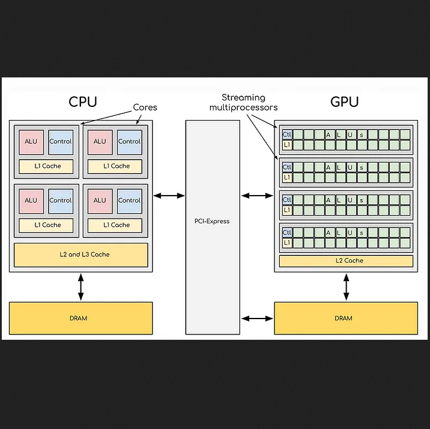
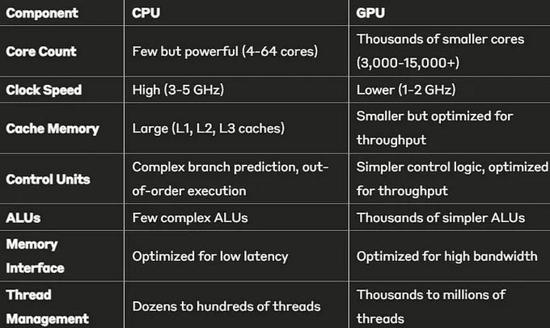
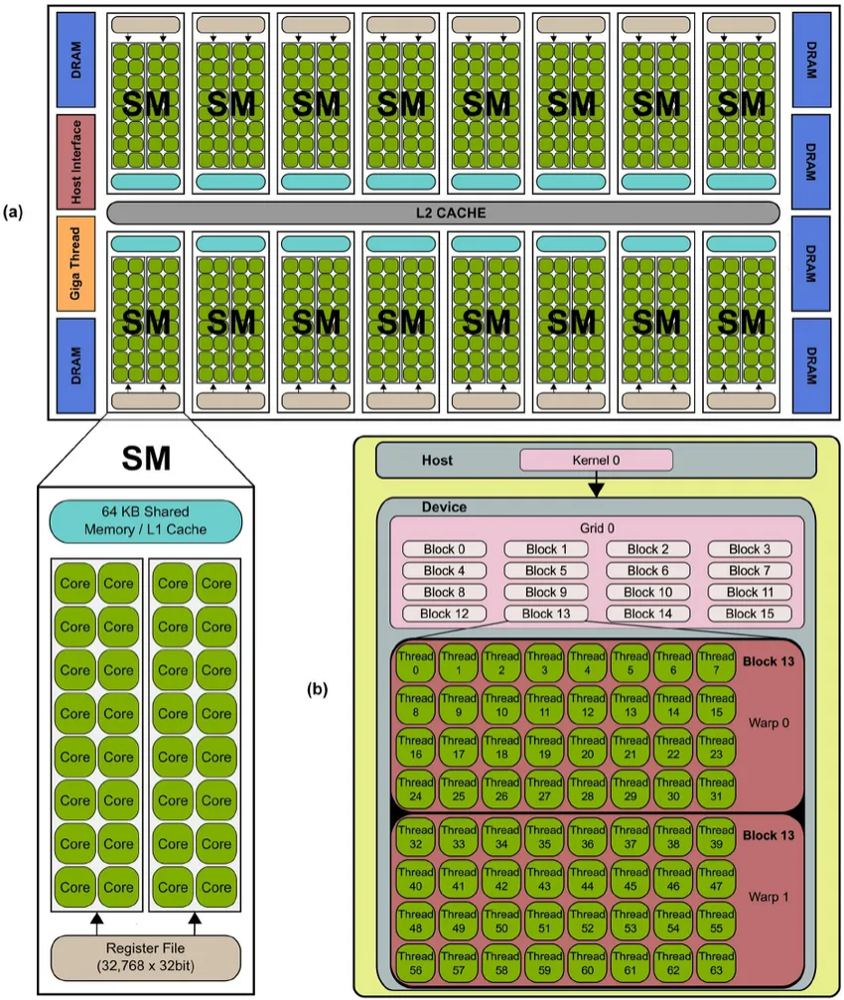
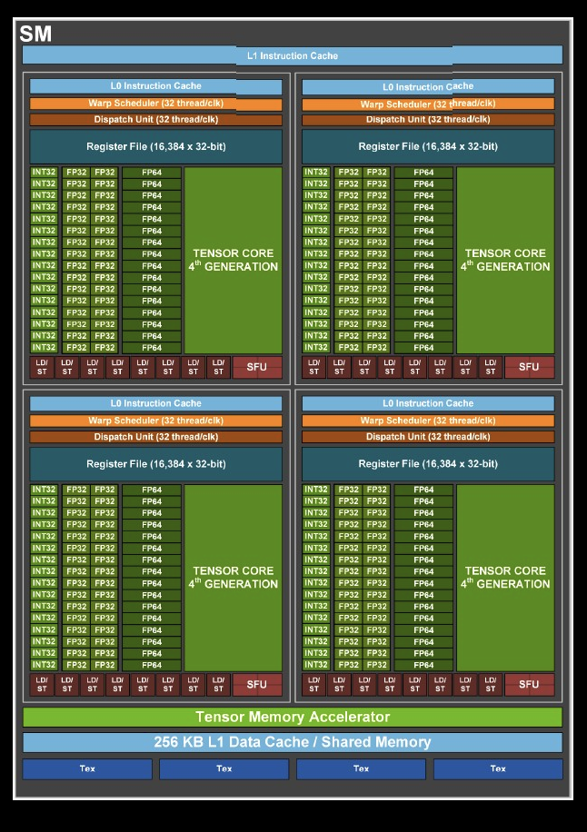

Decoding CPU vs. GPU: A Detailed Exploration of NVIDIA and AMD GPU Architectures

  
*Figure: High-level comparison of CPU and GPU architectures.*

  
*Figure: Summary of architectural strengths.*

---

## Key Metrics

| Metric      | Definition                                                                                   |
|-------------|----------------------------------------------------------------------------------------------|
| **Bandwidth** (VRAM) | Amount of data transferred per second (e.g., GB/s). Critical for moving large model weights and activations efficiently. |
| **Latency** (cache)  | Delay to begin a data transfer (e.g., ns). Important for accessing small, frequently reused data (attention caches, etc.). |
| **Throughput**       | Useful work completed per second (e.g., tokens/sec or FLOPs). Determined by both bandwidth and latency, plus compute and pipelining efficiency. |

---

## Memory Hierarchy

- **VRAM (GDDR6/HBM)**  
  - **High bandwidth**, higher latency  
  - Used to store entire model weights and large activations (MB → GB scale)  
  - If bandwidth is insufficient, compute units stall waiting for data.

- **Cache (L1/L2)**  
  - **Low latency**, low capacity (KB → MB scale)  
  - Holds “hot” data (e.g., key-value caches in transformers)  
  - Storing all weights here is infeasible due to size and cost constraints.

---

## Memory Bandwidth of Selected GPUs

| GPU Model                   | Memory Type | Bandwidth    | Capacity |
|-----------------------------|-------------|--------------|----------|
| **NVIDIA RTX 5090**         | GDDR7       | 1.79 TB/s     | 32 GB    |
| **AMD Radeon RX 7900 XTX**  | GDDR6       | 960 GB/s      | 24 GB    |
| **NVIDIA Blackwell B200**   | HBM3e       | 8.0 TB/s      | 192 GB   |
| **AMD Instinct MI325X**     | HBM3e       | 6.0 TB/s      | 288 GB   |

---

## Measuring Performance

- **Tokens/sec**  
  How many tokens a model processes or generates per second. Reflects real-world LLM throughput.

- **FLOPs (Floating-Point Operations/sec)**  
  Theoretical compute capacity. Doesn’t always map directly to LLM speed, since memory bandwidth and latency play major roles.

---

## GPU Architecture Highlights

1. **Thousands of Simple Cores**  
   Optimized for parallel math (FP32, FP16, INT8).

2. **SIMD vs. SIMT**  
   - **SIMD (Single Instruction, Multiple Data)**  
     One instruction operates on multiple data elements in lockstep.  
   - **SIMT (Single Instruction, Multiple Threads)**  
     Programmers write many independent threads; the GPU groups them (warps/wavefronts) and executes each group via SIMD hardware.

3. **Typical Core Counts**  
   - **NVIDIA Blackwell B200**  
     - ~208 SMs (Streaming Multiprocessors)  
     - ~96 FP32 cores per SM → 208 × 96 = 19,968 cores (often cited as ~20,480)  
   - **AMD Instinct MI325X**  
     - ~240 CUs (Compute Units)  
     - 64 FP32 ALUs per CU → 240 × 64 = 15,360 cores

---

## CUDA Cores and Execution Model

- **CUDA core** (NVIDIA) / **Stream processor** (AMD) = FP32 ALU  
- **SM** (NVIDIA) / **CU** (AMD) = cluster of cores + shared resources  
- **Warp** (NVIDIA) = 32 threads; **Wavefront** (AMD) = 64 threads  
- **SIMT** groups threads into warps/wavefronts; **SIMD** executes one instruction across all lanes in the group.

---

## GPU Programming Concepts

- **Kernel**  
  A GPU function that runs in parallel on many threads. Written in CUDA (NVIDIA), HIP (AMD), or OpenCL.

- **Tensor**  
  A multi-dimensional array (0D = scalar, 1D = vector, 2D = matrix, etc.).

---

## Example: Matrix Multiplication

When I want to multiply two matrices (say A[1024×1024] × B[1024×1024]):

- I write a **kernel** that describes how to compute one element of the output matrix C.
- At runtime, the GPU launches **one thread per output element** (or per tile), meaning 1024×1024 = ~1 million threads.
- Each output element `C[i][j]` is computed by one **SIMT thread**.
- These threads are grouped into **warps of 32**.
- Each warp is scheduled onto a **Streaming Multiprocessor (SM)**.

Inside the SM:
- The same kernel instruction is executed across threads via **SIMD hardware**, each using its own piece of input data.
- This model is called **SIMT (Single Instruction, Multiple Threads)** — built on top of **SIMD (Single Instruction, Multiple Data)**.

### Key Concepts:
- **SIMT** is the programming model: one thread per output value, written like it's independent.
- **SIMD** is how the GPU really runs it: one instruction across 32 values at once.
- Each thread is assigned to **one SIMD lane (FP32 ALU)** during that instruction.
- All threads in a warp **share the SIMD unit**, executing in **lockstep**.

This represents a **50–100× speedup** over CPU execution, showing why GPUs are essential for deep learning and scientific computing.

---

## How Execution Works (Simplified)

### You (the programmer) write:
- A kernel: the math to compute one result (e.g., one element in matrix C)
- You launch **many threads**: each does one piece of work

### GPU groups threads into **warps**:
- Every 32 threads = 1 warp (NVIDIA standard)
- Warps are scheduled **together**, not one thread at a time

### Each **SM (Streaming Multiprocessor)**:
- Handles **multiple warps at once**
- Has **SIMD lanes (FP32 ALUs / CUDA cores)** that run **one instruction across all threads in a warp** (this part is handled by hardware, not the programmer)

---

# NVIDIA GPU Architecture — An In-Depth Analysis

### 1. Streaming Multiprocessor (SM)

The SM is the fundamental building block of NVIDIA GPUs, similar to a “core complex” in CPU terminology. Each modern NVIDIA GPU contains dozens to hundreds of SMs.

Each SM contains:
- CUDA cores (64–128 per SM in modern architectures)
- Tensor cores (specialized for AI computation)
- Warp schedulers and dispatch units
- Register files (local memory)
- Shared memory/L1 cache
- Special Function Units (SFUs) for transcendental operations

---

### 2. CUDA Cores

CUDA cores are the basic computational units that handle **standard floating-point and integer calculations**.

Modern NVIDIA GPUs contain thousands of CUDA cores (e.g., **RTX 4090 has 16,384**).

Each CUDA core can perform:
- Floating-point addition or multiplication per clock
- Integer operations
- Logic operations (AND, OR, XOR)

---

### 3. Tensor Cores

Introduced with the **Volta architecture**, Tensor Cores are specialized hardware accelerators for matrix operations used in deep learning:

- Matrix-multiply-accumulate operations
- Mixed precision computation (FP16, FP8, INT8)
- **2–8× faster** than traditional CUDA cores for AI workloads

For example:
> A single **4th generation Tensor Core** in Hopper can perform **1,024 floating-point operations per clock cycle**.

**Note:** CUDA cores and Tensor Cores are **separate physical hardware units** within the SM.

#### Comparison Table

| Feature        | **CUDA Cores**                           | **Tensor Cores**                                            |
| -------------- | ---------------------------------------- | ----------------------------------------------------------- |
| Purpose        | General-purpose scalar/vector math       | Matrix math acceleration (GEMM: General Matrix Multiply)    |
| Operations     | FP32, INT, logic (add, mul, AND, etc.)   | Fused matrix-multiply-accumulate (e.g., A×B+C)              |
| Precision      | FP32, INT32                              | FP16, FP8, BF16, INT8, TF32 (mixed precision)               |
| Speed (AI ops) | Slower for matrix ops                    | 2–8× faster for LLM workloads                               |
| Used for       | Game physics, graphics shading, logic    | Neural networks (training/inference), LLM matrix ops        |
| Hardware       | Simple ALUs (1 instruction/clock/thread) | Specialized matrix ALUs (process **tiles** of data at once) |

---

### 4. How They Work Together (LLM Workloads)

For a typical **LLM workload**:
- **Tensor Cores** handle heavy matrix multiplications (e.g., attention layers)
- **CUDA Cores** handle:
  - Indexing
  - Softmax normalization
  - Activation functions
  - Looping and control flow

---

## Hopper Architecture (H100 Example)

### SM Composition:
Each SM contains:
- **128 CUDA cores**
- **4 Tensor Cores (4th gen)**

---

### Memory Hierarchy:

| Level           | Function                                                                |
|-----------------|-------------------------------------------------------------------------|
| **Global Memory (VRAM)** | Large, high-bandwidth memory (GDDR6/HBM), used to store model weights and activations |
| **L2 Cache**     | Shared across all SMs (e.g., up to 96MB in H100)                        |
| **L1 Cache / Shared Memory** | Fast per-SM memory, software-managed                        |
| **Registers**    | Fastest memory; thread-private storage inside the SM                   |

---

### NVIDIA Hopper SM Layout (H100)

| Component                          | Description |
|-----------------------------------|-------------|
| **Warp Scheduler**                | Schedules 32 threads/clock |
| **Dispatch Unit**                 | Sends instructions to execution units |
| **Register File (16,384 × 32-bit)** | Per-partition thread registers |
| **INT32 / FP32 / FP64 Units**     | ALUs for integer and floating-point math |
| **Tensor Core (4th Gen)**         | Handles matrix-multiply at high throughput |
| **SFU (Special Function Unit)**   | Executes sin, cos, exp, etc. |
| **LD/ST Units**                   | Load/Store units for memory access |
| **256 KB L1 Data Cache / Shared Mem** | Fast on-chip data exchange |
| **Tensor Memory Accelerator**     | Optimizes tensor feeding to cores |
| **Tex Units**                     | Texture units (used for ML or graphics) |

---

### One SM Contains:
- **128 CUDA cores (FP32 ALUs)** = It’s 64 per sub-partition × 2 = 128.
- **4 Tensor Cores (4th Gen)** = 1 per subpartition

---

### Hopper (H100 Full GPU):
- **132 SMs**
- **16,896 CUDA cores**
- **528 Tensor Cores**
- **80 GB HBM3 memory with 3 TB/s bandwidth**
- **50 MB L2 Cache**
- **New Transformer Engine for optimized LLM inference/training**

---

# AMD GPU Architecture – In-Depth Analysis

AMD takes a somewhat different approach to GPU design with their RDNA (gaming) and CDNA (compute) architectures. This document focuses on CDNA-style, data-center GPUs (e.g., MI300).

---

## Core Components

### Compute Units (CUs)
The Compute Unit is AMD’s equivalent to NVIDIA’s Streaming Multiprocessor (SM). Each CU contains:
- **4 SIMD units** (each with 16 ALUs/stream processors → 64 total per CU)
- **Wavefront Scheduler**
- **Local Data Share (LDS)** memory
- **Scalar & vector registers**
- **L0 instruction cache** & **L1 data cache**

### Stream Processors
AMD’s basic ALUs, equivalent to NVIDIA’s CUDA cores:
- Organized into **16-wide SIMD units** (vector cores)
- Newer designs also include **Matrix Cores** (AI accelerators) for GEMM
- Executes floating-point and integer instructions
- **64 stream processors per CU** in modern designs (4 SIMD × 16 lanes)

---

## Memory Architecture

- **Infinity Cache** (up to 256 MB L3)  
  Reduces VRAM access, benefits long-context LLMs, KV cache reuse, and multi-GPU setups  
- **High-Bandwidth Memory (HBM3)**  
  Used in data-center GPUs for massive bandwidth  
- **GDDR6**  
  Used in consumer graphics cards  
- **Smart Access Memory**  
  Allows CPU direct access to GPU memory

---

## Parallel Execution Model

### SIMD Implementation
- **SIMD units** = groups of 16 ALUs executing one instruction on multiple data elements  
- AMD exposes explicit SIMD control, whereas NVIDIA hides it under SIMT

### SIMT via Wavefronts
- AMD groups threads into **64-thread wavefronts** (vs. NVIDIA’s 32-thread warps)  
- All threads in a wavefront execute the same instruction in lockstep, with independent state  
- **Larger wavefronts** improve throughput on uniform workloads but penalize divergence  
- A single wavefront runs on one SIMD unit over **4 cycles** (16 lanes × 4)

### CU-Level Parallelism
- Each CU has **4 SIMD units**, so it can execute **4 wavefronts in parallel**  
- **Example**: 256 threads = 4 wavefronts → each SIMD unit handles one wavefront → after 4 cycles all 256 threads complete

---

## AMD MI300 Example

- **Compute Units:** 228  
- **Stream Processors:** 14,592  
- **Infinity Cache:** 256 MB  
- **Memory:** 128 GB HBM3  
- Mixed-precision compute optimized for AI/ML  

---

## Comparison: AMD vs NVIDIA (256 threads)

| Feature                     | AMD (CU)                         | NVIDIA (SM)                      |
|-----------------------------|----------------------------------|----------------------------------|
| Thread group size           | 64 threads (wavefront)           | 32 threads (warp)                |
| SIMD lane width             | 16                               | 32                               |
| Threads per SIMD per cycle  | 16                               | 32                               |
| Cycles to finish one group  | 4 (wavefront)                    | 1 (warp)                         |
| Parallel units per block    | 4 SIMD units per CU              | Multiple warp schedulers per SM  |
| Cycles for 256 threads      | 4                                | 2                                |
| Scheduling granularity      | Wavefront                        | Warp                             |

---

## Performance Notes

- **AMD**’s larger wavefronts and SIMD model excel on highly uniform, predictable workloads (e.g., large matrix multiplies in LLMs).  
- **NVIDIA**’s SIMT/warp model finishes each group faster, offers finer-grained divergence handling, and better latency hiding for mixed or irregular workloads.

